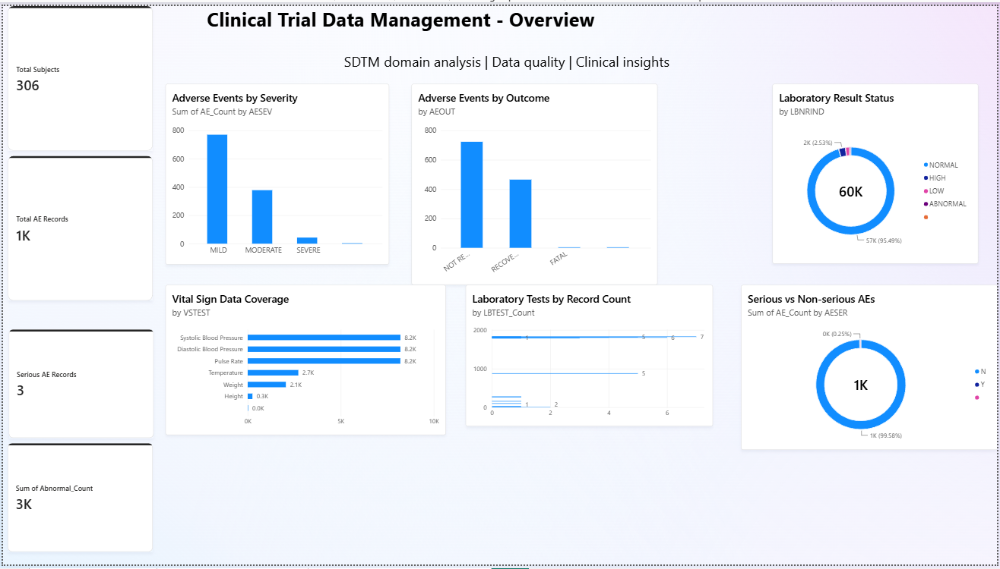
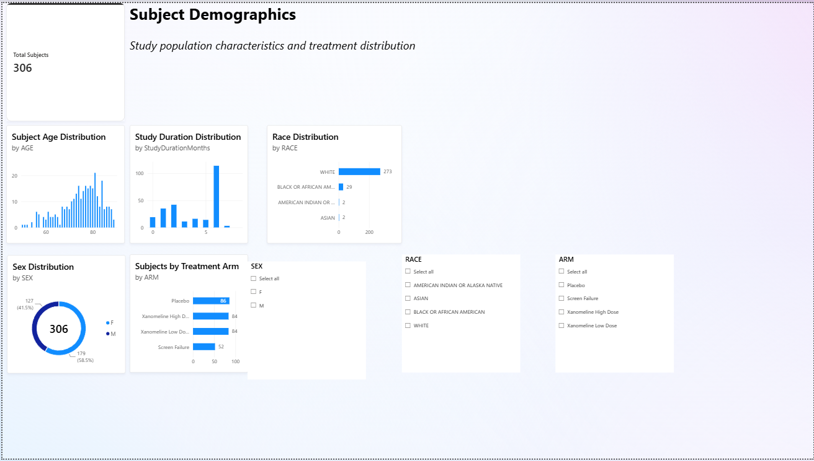
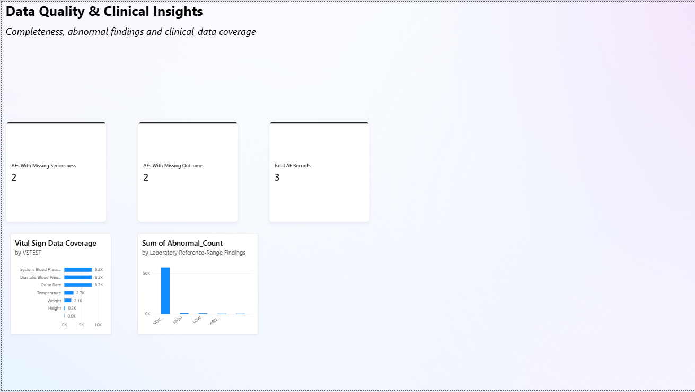

# Clinical Trial Data Management & Quality Dashboard

A self-directed clinical data management portfolio project using simulated clinical-trial datasets to practice data cleaning, SDTM-style domain review, quality checks, summary analysis, and Power BI dashboard development.

## Project Objective

To practice a practical clinical data management workflow by:

* Reviewing and cleaning clinical-trial datasets
* Working with SDTM-style clinical domains
* Performing basic data-quality and completeness checks
* Creating domain-level summary tables
* Identifying missing and abnormal data
* Developing an interactive Power BI dashboard for clinical-data review

## Domains Used

The project included the following clinical domains:

| Domain | Description             |
| ------ | ----------------------- |
| DM     | Demographics            |
| AE     | Adverse Events          |
| LB     | Laboratory Tests        |
| VS     | Vital Signs             |
| CM     | Concomitant Medications |
| SV     | Subject Visits          |

## Workflow

```text
Raw Clinical CSV Files
        ↓
Excel / Power Query
        ↓
Data Cleaning & Type Checks
        ↓
Missing / Duplicate / QC Checks
        ↓
Domain-Level Summaries
        ↓
Power BI
        ↓
Interactive Clinical Data Dashboard
```

## Tools Used

* Microsoft Excel
* Power Query
* Power BI
* GitHub
* Basic data-quality analysis
* SDTM-style clinical-domain concepts

## Analysis Performed

### 1. Demographics — DM

The DM domain was used to review:

* Total subjects
* Age distribution
* Sex distribution
* Race distribution
* Treatment-arm distribution
* Study duration

**Total subjects analyzed: 306**

### 2. Adverse Events — AE

AE data was summarized by severity, seriousness, and outcome.

Key observations:

| AE Measure                   | Records |
| ---------------------------- | ------: |
| Total AE records             |   1,193 |
| Mild                         |     770 |
| Moderate                     |     378 |
| Severe                       |      43 |
| Serious                      |       3 |
| Not recovered / Not resolved |     723 |
| Recovered / Resolved         |     465 |
| Fatal                        |       3 |
| Missing seriousness          |       2 |
| Missing outcome              |       2 |

These values represent recorded data in the simulated dataset and are not clinical conclusions about causality or treatment safety.

### 3. Laboratory Tests — LB

Laboratory results were reviewed by test and reference-range status.

| Result Status | Records |
| ------------- | ------: |
| Normal        |  56,892 |
| Low           |     860 |
| High          |   1,505 |
| Abnormal      |     318 |
| Blank         |       5 |

The combined count of Low, High, and Abnormal results was **2,683**.

### 4. Vital Signs — VS

Vital-sign data was summarized by test to review the distribution and coverage of recorded measurements.

## Power BI Dashboard
### Dashboard Preview

#### Clinical Overview


#### Subject Demographics


#### Data Quality & Clinical Insights


### Page 1 — Clinical Trial Data Management Overview

Includes:

* Total subjects
* Total AE records
* Serious AE records
* Abnormal laboratory results
* AE severity
* AE outcome
* Serious vs non-serious AE records
* Laboratory result status
* Vital-sign data coverage

### Page 2 — Subject Demographics

Includes:

* Subject population
* Age distribution
* Sex distribution
* Race distribution
* Treatment-arm distribution
* Study duration
* Interactive slicers for demographic review

### Page 3 — Data Quality & Clinical Insights

Includes:

* Missing AE seriousness
* Missing AE outcome
* Fatal AE records
* Laboratory reference-range findings
* Vital-sign data coverage

## Data Quality Focus

The project specifically practiced identifying:

* Missing values
* Blank categories
* Data-type inconsistencies
* Duplicate records
* Abnormal laboratory findings
* Domain-level record distributions
* Basic consistency checks between raw data and summarized outputs

## What I Learned

Through this project, I practiced:

* Clinical-domain data handling
* SDTM-style dataset structures
* Excel Power Query
* Data cleaning and transformation
* Basic clinical data QC
* Summary-table generation
* Power BI visualization
* Interactive filtering
* Translating clinical datasets into understandable data-quality insights

## Project Scope

This is a **self-directed portfolio project using simulated/educational clinical-trial data**.

It demonstrates clinical data-management concepts and workflow practice. It is not a production clinical trial database and does not represent validated clinical-trial, regulatory-submission, or patient-level decision-making work.

## Author

**Sayed Munazza Saniya**

M.Sc. Biotechnology | Clinical Data Management & Pharmacovigilance Enthusiast

[LinkedIn](linkedin.com/in/sdmunazza1242/) · [GitHub]([YOUR_GITHUB_URL](https://github.com/sdmunazza12/clinical-trial-cdm-quality-dashboard/edit/main/README.md))
